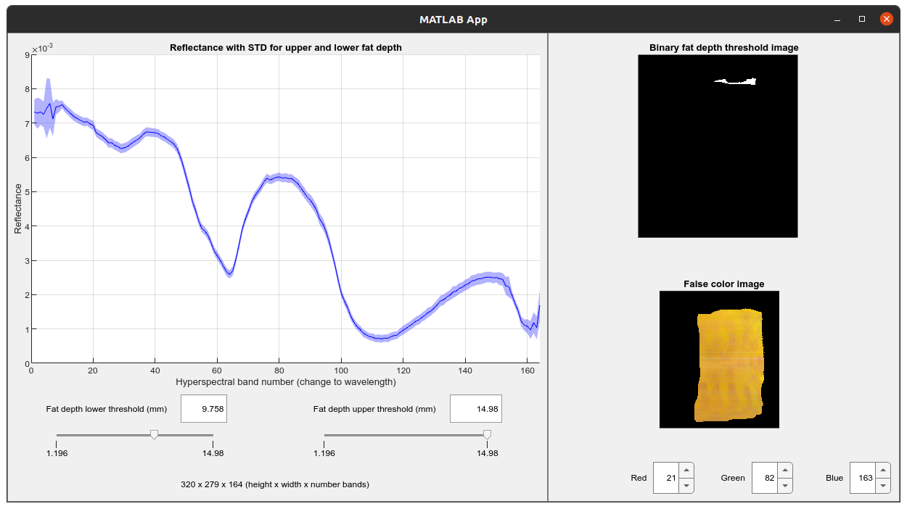

# Hypercube Fat Depth Viewer

Shows the spectral mean and STD with varying fat depth (a scalar value) from a hypercube and corresponding fat depth image.

Set the minimum and maximum fat depth values to display in the graph using the sliders.

**Requirements**

MATLAB (working in R2022B)

    

## Startup

Run the script `StartupApp.m` in MATLAB. This will load the test dataset from the MAT file called "reflectance_hypercube_lamb_cut.mat".

## TODO

- Generalise so that any scalar value can be input
- add option for displaying discrete classes for classification problems.
